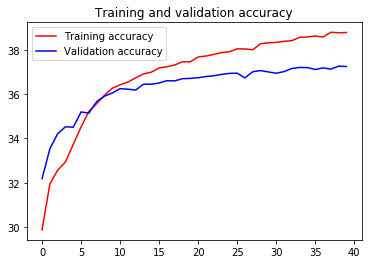
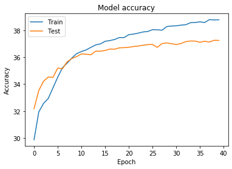
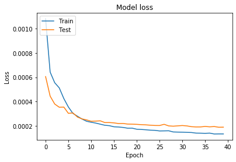
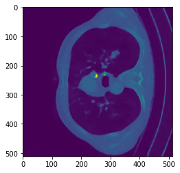
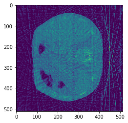
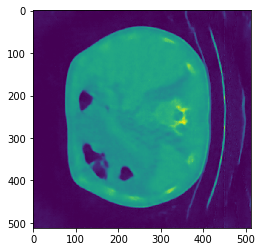

**Unet model to remove artifacts from the sparseview images**.

This project uses Keras API and Tensorflow 1.15 to implement the original Unet model.
Planning to upgrade code to tensorflow 2.X. Some part of code might be from Google course on Tensorflow with Laurence Moroney.


```python

from google.colab import drive
drive.mount('/content/drive')
```

    Drive already mounted at /content/drive; to attempt to forcibly remount, call drive.mount("/content/drive", force_remount=True).


To keep using Tensoftlow 1.15 need the code below. By defaut the colab will start using Tnsorflow 2.X


```python
# %tensorflow_version 1.x
# import tensorflow as tf
print(tf.__version__)
```

    1.15.0


```python

import os
import zipfile
import random
import keras
import tensorflow as tf
import numpy as np
import matplotlib.pyplot as plt
import matplotlib.image as mpimg
from keras.layers import Concatenate
from keras.models import Sequential
from keras.layers import Conv2D, MaxPooling2D, Input, Dense
from keras.layers import BatchNormalization, Activation, Dropout, Subtract
from keras.models import Model
from glob import glob
from keras.layers.convolutional import Conv2DTranspose
from keras.layers import concatenate


```

If we have weights we can downoad weight without training a model. loaded_model.load_weights("model.h5")


```python
# loaded_model.load_weights("model.h5")
```


```python
print(len(os.listdir('/content/drive/My Drive/Colab Notebooks/CT_data/sparseview_60/train')))
print(len(os.listdir('/content/drive/My Drive/Colab Notebooks/CT_data/ndct/train')))
# 3600
# 3600
```

    3600
    3600


```python
print(len(os.listdir('/content/drive/My Drive/Colab Notebooks/CT_data/sparseview_60/test/')))
print(len(os.listdir('/content/drive/My Drive/Colab Notebooks/CT_data/ndct/test/')))
# # 354
# # 354
```

    354
    354


```python
ndct = sorted(glob('/content/drive/My Drive/Colab Notebooks/CT_data/ndct/train/*'))
ldct = sorted(glob('/content/drive/My Drive/Colab Notebooks/CT_data/sparseview_60/train/*'))

ndct_test = sorted(glob('/content/drive/My Drive/Colab Notebooks/CT_data/ndct/test/*'))
ldct_test = sorted(glob('/content/drive/My Drive/Colab Notebooks/CT_data/sparseview_60/test/*'))

print(len(ndct))
print(len(ldct))
print(len(ndct_test))
print(len(ldct_test))
```

    3600
    3600
    354
    354


The formulas below will be used to calculate the quality of the reconstruction. Higher PSNR generally indicates high quality of reconstruction.


```python
def cal_psnr(im1, im2):
    # assert pixel value range is 0-255 and type is uint8
    mse = ((im1.astype(np.float) - im2.astype(np.float)) ** 2).mean()
    maxval = np.amax(im1)
    psnr = 10 * np.log10(maxval ** 2 / mse)
    return psnr

def tf_psnr(im1, im2):
    # assert pixel value range is 0-1
    #mse = tf.losses.mean_squared_error(labels=im2 * 255.0, predictions=im1 * 255.0)
    mse = tf.compat.v1.losses.mean_squared_error(labels=im2 * 255.0, predictions=im1 * 255.0)
    return 10.0 * (tf.log(255.0 ** 2 / mse) / tf.log(10.0))
```

Useing less data: #for i in range(0, 600). Have 3600 in all.
Processing 3600 images takes aprox. 20 minutes to run. But once we create .npy aray we don't have to rerun this code in the future and we will have .npy form of our data. Colab has 11GB RAM limit.


```python
ndct_imgs_train = []
# for i in range(0, len(ndct)):                                                                                                                                      
for i in range(0, 600):
    f = open(ndct[i],'rb')
    a = np.fromfile(f, np.float32)
    ndct_imgs_train.append(a)
    f.close()
print("len(ndct_imgs_train)....: ",len(ndct_imgs_train))
#len(ndct_imgs_train)....:  3600                                                                                                                                                         
```

    len(ndct_imgs_train)....:  600


Using different range to use less data to train #for i in range(0, 600). In all have 3600 images. It takes aprox. 20 minutes to process all 3600. But once we create .npy aray we don't have to rerun this code in the future and we will have .npy form of our data.


```python
ldct_imgs_train = []
# for i in range(0, len(ldct)):
for i in range(0, 600):
    f = open(ldct[i],'rb')
    a = np.fromfile(f, np.float32)
    ldct_imgs_train.append(a)
    f.close()
print("len(ldct_imgs_train)....: ",len(ldct_imgs_train))
```

    len(ldct_imgs_train)....:  600


only using 100 images to test. In total we have 354 testing images.


```python
ndct_imgs_test = []
# for i in range(0, len(ndct_test)):
for i in range(0, 100):
    f = open(ndct_test[i],'rb')
    a = np.fromfile(f, np.float32)
    ndct_imgs_test.append(a)
    f.close()
print("len(ndct_imgs_test)....: ",len(ndct_imgs_test))

```

    len(ndct_imgs_test)....:  100


only using 100 images to test. In total we have 354 images


```python
# load the image
ldct_imgs_test = []
# for i in range(0, len(ldct_test)):
for i in range(0, 100):
    f = open(ldct_test[i],'rb')
    a = np.fromfile(f, np.float32)
    ldct_imgs_test.append(a)
    f.close()
print("len(ldct_imgs_test)....: ",len(ldct_imgs_test))

```

    len(ldct_imgs_test)....:  100


Must reshape images to train


```python
ldct_train = np.asarray(ldct_imgs_train)
ndct_train = np.asarray(ndct_imgs_train)

ldct_train = ldct_train.reshape(600,512,512,1)
ndct_train = ndct_train.reshape(600,512,512,1)

ldct_test = np.asarray(ldct_imgs_test)
ndct_test = np.asarray(ndct_imgs_test)

# ldct_test = ldct_test.reshape(len(ldct_imgs_test),512,512,1)
# ndct_test = ndct_test.reshape(len(ldct_imgs_test),512,512,1)

ldct_test = ldct_test.reshape(100,512,512,1)
ndct_test = ndct_test.reshape(100,512,512,1)

print(ldct_train.shape)
print(ndct_train.shape)
print(ldct_test.shape)
print(ndct_test.shape)

```

    (600, 512, 512, 1)
    (600, 512, 512, 1)
    (100, 512, 512, 1)
    (100, 512, 512, 1)


```python
# np.save('sparseview_60_train_600', ldct_train) # save the file as "sparseview_60_train.npy" 
# np.save('ndct_train_600', ndct_train) # save the file as "ndct_train.npy" 

# np.save('sparseview_60_test_100', ldct_test) # save the file as "sparseview_60_test.npy" 
# np.save('ndct_test_100', ndct_test) # save the file as "ndct_test.npy" 


np.save('/content/drive/My Drive/Colab Notebooks/unet_15/sparseview_60_train_600', ldct_train) # save the file as "sparseview_60_train.npy" 
np.save('/content/drive/My Drive/Colab Notebooks/unet_15/ndct_train_600', ndct_train) # save the file as "ndct_train.npy" 

np.save('/content/drive/My Drive/Colab Notebooks/unet_15/sparseview_60_test_100', ldct_test) # save the file as "sparseview_60_test.npy" 
np.save('/content/drive/My Drive/Colab Notebooks/unet_15/ndct_test_100', ndct_test) # save the file as "ndct_test.npy"
```


```python
sparseview_60_train = np.load('/content/drive/My Drive/Colab Notebooks/unet_15/sparseview_60_train_600.npy') # loads saved array into variable sparseview_60_train.
ndct_train = np.load('/content/drive/My Drive/Colab Notebooks/unet_15/ndct_train_600.npy') # loads saved array into variable ndct_train.
sparseview_60_test = np.load('/content/drive/My Drive/Colab Notebooks/unet_15/sparseview_60_test_100.npy') # loads saved array into variable sparseview_60_test.
ndct_test = np.load('/content/drive/My Drive/Colab Notebooks/unet_15/ndct_test_100.npy') # loads saved array into variable ndct_test.

# sparseview_60_train = np.load('sparseview_60_train_600.npy') # loads saved array into variable sparseview_60_train.
# ndct_train = np.load('ndct_train_600.npy') # loads saved array into variable ndct_train.
# sparseview_60_test = np.load('sparseview_60_test_100.npy') # loads saved array into variable sparseview_60_test.
# ndct_test = np.load('ndct_test_100.npy') # loads saved array into variable ndct_test.

```

Basic UNet model


```python
inputs = Input((None, None,1))

c1 = Conv2D(8, (3, 3), activation='relu', padding='same') (inputs)
c1 = Conv2D(8, (3, 3), activation='relu', padding='same') (c1)
p1 = MaxPooling2D((2, 2)) (c1)

c2 = Conv2D(16, (3, 3), activation='relu', padding='same') (p1)
c2 = Conv2D(16, (3, 3), activation='relu', padding='same') (c2)
p2 = MaxPooling2D((2, 2)) (c2)

c3 = Conv2D(32, (3, 3), activation='relu', padding='same') (p2)
c3 = Conv2D(32, (3, 3), activation='relu', padding='same') (c3)
p3 = MaxPooling2D((2, 2)) (c3)


c4 = Conv2D(64, (3, 3), activation='relu', padding='same') (p3)
c4 = Conv2D(64, (3, 3), activation='relu', padding='same') (c4)
p4 = MaxPooling2D(pool_size=(2, 2)) (c4)

c5 = Conv2D(128, (3, 3), activation='relu', padding='same') (p4)
c5 = Conv2D(128, (3, 3), activation='relu', padding='same') (c5)

u6 = Conv2DTranspose(64, (2, 2), strides=(2, 2), padding='same') (c5)
u6 = concatenate([u6, c4])
c6 = Conv2D(64, (3, 3), activation='relu', padding='same') (u6)
c6 = Conv2D(64, (3, 3), activation='relu', padding='same') (c6)


u7 = Conv2DTranspose(32, (2, 2), strides=(2, 2), padding='same') (c6)
u7 = concatenate([u7, c3])
c7 = Conv2D(32, (3, 3), activation='relu', padding='same') (u7)
c7 = Conv2D(32, (3, 3), activation='relu', padding='same') (c7)

u8 = Conv2DTranspose(16, (2, 2), strides=(2, 2), padding='same') (c7)
u8 = concatenate([u8, c2])
c8 = Conv2D(16, (3, 3), activation='relu', padding='same') (u8)
c8 = Conv2D(16, (3, 3), activation='relu', padding='same') (c8)

u9 = Conv2DTranspose(8, (2, 2), strides=(2, 2), padding='same') (c8)
u9 = concatenate([u9, c1])
c9 = Conv2D(8, (3, 3), activation='relu', padding='same') (u9)
c9 = Conv2D(8, (3, 3), activation='relu', padding='same') (c9)

output_img = Conv2D(1, (1, 1)) (c9)
subtracted = Subtract()([inputs, output_img])
# subtracted = keras.layers.Subtract()([net, output_img])

unet_15_model = Model(inputs=[inputs], outputs=[subtracted])
unet_15_model.compile(optimizer='adam', loss='mse', metrics=[tf_psnr])


```


```python
unet_15_model.summary()
```

    Model: "model_4"
    __________________________________________________________________________________________________
    Layer (type)                    Output Shape         Param #     Connected to                     
    ==================================================================================================
    input_4 (InputLayer)            (None, None, None, 1 0                                            
    __________________________________________________________________________________________________
    conv2d_58 (Conv2D)              (None, None, None, 8 80          input_4[0][0]                    
    __________________________________________________________________________________________________
    conv2d_59 (Conv2D)              (None, None, None, 8 584         conv2d_58[0][0]                  
    __________________________________________________________________________________________________
    max_pooling2d_13 (MaxPooling2D) (None, None, None, 8 0           conv2d_59[0][0]                  
    __________________________________________________________________________________________________
    conv2d_60 (Conv2D)              (None, None, None, 1 1168        max_pooling2d_13[0][0]           
    __________________________________________________________________________________________________
    conv2d_61 (Conv2D)              (None, None, None, 1 2320        conv2d_60[0][0]                  
    __________________________________________________________________________________________________
    max_pooling2d_14 (MaxPooling2D) (None, None, None, 1 0           conv2d_61[0][0]                  
    __________________________________________________________________________________________________
    conv2d_62 (Conv2D)              (None, None, None, 3 4640        max_pooling2d_14[0][0]           
    __________________________________________________________________________________________________
    conv2d_63 (Conv2D)              (None, None, None, 3 9248        conv2d_62[0][0]                  
    __________________________________________________________________________________________________
    max_pooling2d_15 (MaxPooling2D) (None, None, None, 3 0           conv2d_63[0][0]                  
    __________________________________________________________________________________________________
    conv2d_64 (Conv2D)              (None, None, None, 6 18496       max_pooling2d_15[0][0]           
    __________________________________________________________________________________________________
    conv2d_65 (Conv2D)              (None, None, None, 6 36928       conv2d_64[0][0]                  
    __________________________________________________________________________________________________
    max_pooling2d_16 (MaxPooling2D) (None, None, None, 6 0           conv2d_65[0][0]                  
    __________________________________________________________________________________________________
    conv2d_66 (Conv2D)              (None, None, None, 1 73856       max_pooling2d_16[0][0]           
    __________________________________________________________________________________________________
    conv2d_67 (Conv2D)              (None, None, None, 1 147584      conv2d_66[0][0]                  
    __________________________________________________________________________________________________
    conv2d_transpose_13 (Conv2DTran (None, None, None, 6 32832       conv2d_67[0][0]                  
    __________________________________________________________________________________________________
    concatenate_13 (Concatenate)    (None, None, None, 1 0           conv2d_transpose_13[0][0]        
                                                                     conv2d_65[0][0]                  
    __________________________________________________________________________________________________
    conv2d_68 (Conv2D)              (None, None, None, 6 73792       concatenate_13[0][0]             
    __________________________________________________________________________________________________
    conv2d_69 (Conv2D)              (None, None, None, 6 36928       conv2d_68[0][0]                  
    __________________________________________________________________________________________________
    conv2d_transpose_14 (Conv2DTran (None, None, None, 3 8224        conv2d_69[0][0]                  
    __________________________________________________________________________________________________
    concatenate_14 (Concatenate)    (None, None, None, 6 0           conv2d_transpose_14[0][0]        
                                                                     conv2d_63[0][0]                  
    __________________________________________________________________________________________________
    conv2d_70 (Conv2D)              (None, None, None, 3 18464       concatenate_14[0][0]             
    __________________________________________________________________________________________________
    conv2d_71 (Conv2D)              (None, None, None, 3 9248        conv2d_70[0][0]                  
    __________________________________________________________________________________________________
    conv2d_transpose_15 (Conv2DTran (None, None, None, 1 2064        conv2d_71[0][0]                  
    __________________________________________________________________________________________________
    concatenate_15 (Concatenate)    (None, None, None, 3 0           conv2d_transpose_15[0][0]        
                                                                     conv2d_61[0][0]                  
    __________________________________________________________________________________________________
    conv2d_72 (Conv2D)              (None, None, None, 1 4624        concatenate_15[0][0]             
    __________________________________________________________________________________________________
    conv2d_73 (Conv2D)              (None, None, None, 1 2320        conv2d_72[0][0]                  
    __________________________________________________________________________________________________
    conv2d_transpose_16 (Conv2DTran (None, None, None, 8 520         conv2d_73[0][0]                  
    __________________________________________________________________________________________________
    concatenate_16 (Concatenate)    (None, None, None, 1 0           conv2d_transpose_16[0][0]        
                                                                     conv2d_59[0][0]                  
    __________________________________________________________________________________________________
    conv2d_74 (Conv2D)              (None, None, None, 8 1160        concatenate_16[0][0]             
    __________________________________________________________________________________________________
    conv2d_75 (Conv2D)              (None, None, None, 8 584         conv2d_74[0][0]                  
    __________________________________________________________________________________________________
    conv2d_76 (Conv2D)              (None, None, None, 1 9           conv2d_75[0][0]                  
    __________________________________________________________________________________________________
    subtract_4 (Subtract)           (None, None, None, 1 0           input_4[0][0]                    
                                                                     conv2d_76[0][0]                  
    ==================================================================================================
    Total params: 485,673
    Trainable params: 485,673
    Non-trainable params: 0
    __________________________________________________________________________________________________


```python
history=unet_15_model.fit(sparseview_60_train, ndct_train, validation_split=0.05, batch_size=10, epochs=40)

```

    Train on 570 samples, validate on 30 samples
    Epoch 1/40
    570/570 [==============================] - 8s 14ms/step - loss: 0.0011 - tf_psnr: 29.8746 - val_loss: 6.0528e-04 - val_tf_psnr: 32.1868
    Epoch 2/40
    570/570 [==============================] - 6s 11ms/step - loss: 6.4226e-04 - tf_psnr: 31.9359 - val_loss: 4.4407e-04 - val_tf_psnr: 33.5280
    Epoch 3/40
    570/570 [==============================] - 6s 11ms/step - loss: 5.5474e-04 - tf_psnr: 32.5680 - val_loss: 3.7929e-04 - val_tf_psnr: 34.2114
    Epoch 4/40
    570/570 [==============================] - 6s 11ms/step - loss: 5.1210e-04 - tf_psnr: 32.9381 - val_loss: 3.5278e-04 - val_tf_psnr: 34.5253
    Epoch 5/40
    570/570 [==============================] - 6s 11ms/step - loss: 4.2431e-04 - tf_psnr: 33.7333 - val_loss: 3.5429e-04 - val_tf_psnr: 34.5068
    Epoch 6/40
    570/570 [==============================] - 6s 11ms/step - loss: 3.5475e-04 - tf_psnr: 34.5162 - val_loss: 3.0247e-04 - val_tf_psnr: 35.1934
    Epoch 7/40
    570/570 [==============================] - 6s 11ms/step - loss: 3.0184e-04 - tf_psnr: 35.2188 - val_loss: 3.0599e-04 - val_tf_psnr: 35.1436
    Epoch 8/40
    570/570 [==============================] - 6s 11ms/step - loss: 2.7854e-04 - tf_psnr: 35.5686 - val_loss: 2.7163e-04 - val_tf_psnr: 35.6607
    Epoch 9/40
    570/570 [==============================] - 6s 11ms/step - loss: 2.5537e-04 - tf_psnr: 35.9455 - val_loss: 2.5682e-04 - val_tf_psnr: 35.9038
    Epoch 10/40
    570/570 [==============================] - 6s 11ms/step - loss: 2.3720e-04 - tf_psnr: 36.2658 - val_loss: 2.4841e-04 - val_tf_psnr: 36.0484
    Epoch 11/40
    570/570 [==============================] - 6s 11ms/step - loss: 2.2914e-04 - tf_psnr: 36.4175 - val_loss: 2.3741e-04 - val_tf_psnr: 36.2453
    Epoch 12/40
    570/570 [==============================] - 6s 11ms/step - loss: 2.2234e-04 - tf_psnr: 36.5442 - val_loss: 2.3879e-04 - val_tf_psnr: 36.2200
    Epoch 13/40
    570/570 [==============================] - 6s 11ms/step - loss: 2.1329e-04 - tf_psnr: 36.7304 - val_loss: 2.4082e-04 - val_tf_psnr: 36.1833
    Epoch 14/40
    570/570 [==============================] - 6s 11ms/step - loss: 2.0434e-04 - tf_psnr: 36.9095 - val_loss: 2.2666e-04 - val_tf_psnr: 36.4464
    Epoch 15/40
    570/570 [==============================] - 6s 11ms/step - loss: 2.0087e-04 - tf_psnr: 36.9880 - val_loss: 2.2676e-04 - val_tf_psnr: 36.4444
    Epoch 16/40
    570/570 [==============================] - 6s 11ms/step - loss: 1.9180e-04 - tf_psnr: 37.1796 - val_loss: 2.2391e-04 - val_tf_psnr: 36.4994
    Epoch 17/40
    570/570 [==============================] - 6s 11ms/step - loss: 1.8997e-04 - tf_psnr: 37.2328 - val_loss: 2.1857e-04 - val_tf_psnr: 36.6044
    Epoch 18/40
    570/570 [==============================] - 6s 11ms/step - loss: 1.8650e-04 - tf_psnr: 37.3124 - val_loss: 2.1908e-04 - val_tf_psnr: 36.5942
    Epoch 19/40
    570/570 [==============================] - 6s 11ms/step - loss: 1.8018e-04 - tf_psnr: 37.4578 - val_loss: 2.1413e-04 - val_tf_psnr: 36.6933
    Epoch 20/40
    570/570 [==============================] - 6s 11ms/step - loss: 1.8042e-04 - tf_psnr: 37.4549 - val_loss: 2.1338e-04 - val_tf_psnr: 36.7085
    Epoch 21/40
    570/570 [==============================] - 6s 11ms/step - loss: 1.7169e-04 - tf_psnr: 37.6727 - val_loss: 2.1194e-04 - val_tf_psnr: 36.7379
    Epoch 22/40
    570/570 [==============================] - 6s 11ms/step - loss: 1.6985e-04 - tf_psnr: 37.7154 - val_loss: 2.0944e-04 - val_tf_psnr: 36.7894
    Epoch 23/40
    570/570 [==============================] - 6s 11ms/step - loss: 1.6716e-04 - tf_psnr: 37.7864 - val_loss: 2.0763e-04 - val_tf_psnr: 36.8274
    Epoch 24/40
    570/570 [==============================] - 6s 11ms/step - loss: 1.6385e-04 - tf_psnr: 37.8715 - val_loss: 2.0485e-04 - val_tf_psnr: 36.8857
    Epoch 25/40
    570/570 [==============================] - 6s 11ms/step - loss: 1.6253e-04 - tf_psnr: 37.9081 - val_loss: 2.0259e-04 - val_tf_psnr: 36.9339
    Epoch 26/40
    570/570 [==============================] - 6s 11ms/step - loss: 1.5754e-04 - tf_psnr: 38.0414 - val_loss: 2.0225e-04 - val_tf_psnr: 36.9414
    Epoch 27/40
    570/570 [==============================] - 6s 11ms/step - loss: 1.5816e-04 - tf_psnr: 38.0354 - val_loss: 2.1229e-04 - val_tf_psnr: 36.7308
    Epoch 28/40
    570/570 [==============================] - 6s 11ms/step - loss: 1.5898e-04 - tf_psnr: 38.0002 - val_loss: 1.9912e-04 - val_tf_psnr: 37.0088
    Epoch 29/40
    570/570 [==============================] - 6s 11ms/step - loss: 1.4925e-04 - tf_psnr: 38.2711 - val_loss: 1.9682e-04 - val_tf_psnr: 37.0593
    Epoch 30/40
    570/570 [==============================] - 6s 11ms/step - loss: 1.4811e-04 - tf_psnr: 38.3144 - val_loss: 1.9958e-04 - val_tf_psnr: 36.9988
    Epoch 31/40
    570/570 [==============================] - 6s 11ms/step - loss: 1.4744e-04 - tf_psnr: 38.3285 - val_loss: 2.0227e-04 - val_tf_psnr: 36.9408
    Epoch 32/40
    570/570 [==============================] - 6s 11ms/step - loss: 1.4593e-04 - tf_psnr: 38.3782 - val_loss: 1.9899e-04 - val_tf_psnr: 37.0118
    Epoch 33/40
    570/570 [==============================] - 6s 11ms/step - loss: 1.4471e-04 - tf_psnr: 38.4073 - val_loss: 1.9264e-04 - val_tf_psnr: 37.1526
    Epoch 34/40
    570/570 [==============================] - 6s 11ms/step - loss: 1.3978e-04 - tf_psnr: 38.5577 - val_loss: 1.9053e-04 - val_tf_psnr: 37.2004
    Epoch 35/40
    570/570 [==============================] - 6s 11ms/step - loss: 1.3916e-04 - tf_psnr: 38.5758 - val_loss: 1.9076e-04 - val_tf_psnr: 37.1951
    Epoch 36/40
    570/570 [==============================] - 6s 11ms/step - loss: 1.3793e-04 - tf_psnr: 38.6208 - val_loss: 1.9459e-04 - val_tf_psnr: 37.1088
    Epoch 37/40
    570/570 [==============================] - 6s 11ms/step - loss: 1.3965e-04 - tf_psnr: 38.5716 - val_loss: 1.9142e-04 - val_tf_psnr: 37.1801
    Epoch 38/40
    570/570 [==============================] - 6s 11ms/step - loss: 1.3258e-04 - tf_psnr: 38.7885 - val_loss: 1.9386e-04 - val_tf_psnr: 37.1253
    Epoch 39/40
    570/570 [==============================] - 6s 11ms/step - loss: 1.3325e-04 - tf_psnr: 38.7649 - val_loss: 1.8809e-04 - val_tf_psnr: 37.2565
    Epoch 40/40
    570/570 [==============================] - 6s 11ms/step - loss: 1.3310e-04 - tf_psnr: 38.7767 - val_loss: 1.8868e-04 - val_tf_psnr: 37.2427


Save weights for the future reuse.


```python
unet_15_model.save_weights("/content/drive/My Drive/Colab Notebooks/unet_15/model.h5")
```

Plotting PSNR values to see the trend.


```python
import matplotlib.pyplot as plt
acc = history.history['tf_psnr']
val_acc = history.history['val_tf_psnr']
loss = history.history['loss']
val_loss = history.history['val_loss']

epochs = range(len(acc))

plt.plot(epochs, acc, 'r', label='Training accuracy')
plt.plot(epochs, val_acc, 'b', label='Validation accuracy')
plt.title('Training and validation accuracy')
plt.legend(loc=0)
plt.figure()
plt.show()
```





    <Figure size 432x288 with 0 Axes>


```python
reconstructed = unet_15_model.predict(sparseview_60_test)
psnr = cal_psnr(ndct_test, reconstructed)
print("psnr 40 epochs.....",psnr)
```

    psnr 40 epochs..... 34.96571490414341


Save images to a folder


```python
from PIL import Image

a = reconstructed[0].reshape(512, 512)
scalef = np.amax(a)
a = np.clip(255 * a/scalef, 0, 255).astype('uint8')
#result = Image.fromarray((a * 255).astype(np.uint8))                                                                                                
result = Image.fromarray((a).astype(np.uint8))
# result.save('unet_15_600_0.png')
result.save('/content/drive/My Drive/Colab Notebooks/unet_15/reconstructed_unet_15_0.png')

a = reconstructed[99].reshape(512, 512)
scalef = np.amax(a)
a = np.clip(255 * a/scalef, 0, 255).astype('uint8')
#result = Image.fromarray((a * 255).astype(np.uint8))                                                                                                
result = Image.fromarray((a).astype(np.uint8))
# result.save('unet_15_600_99.png')
result.save('/content/drive/My Drive/Colab Notebooks/unet_15/reconstructed_unet_15_99.png')
```

Save original sparseview images to a folder


```python
a = sparseview_60_test[0].reshape(512, 512)
scalef = np.amax(a)
a = np.clip(255 * a/scalef, 0, 255).astype('uint8')
#result = Image.fromarray((a * 255).astype(np.uint8))                                                                                                
result = Image.fromarray((a).astype(np.uint8))
# result.save('unet_15_600_0.png')
result.save('/content/drive/My Drive/Colab Notebooks/unet_15/sparseview_60_test_unet_15_0.png')

a = sparseview_60_test[99].reshape(512, 512)
scalef = np.amax(a)
a = np.clip(255 * a/scalef, 0, 255).astype('uint8')
#result = Image.fromarray((a * 255).astype(np.uint8))                                                                                                
result = Image.fromarray((a).astype(np.uint8))
# result.save('unet_15_600_99.png')
result.save('/content/drive/My Drive/Colab Notebooks/unet_15/sparseview_60_test_unet_15_99.png')
```

Plot model acuracy


```python
# Plot training & validation accuracy values
plt.plot(history.history['tf_psnr'])
plt.plot(history.history['val_tf_psnr'])
plt.title('Model accuracy')
plt.ylabel('Accuracy')
plt.xlabel('Epoch')
plt.legend(['Train', 'Test'], loc='upper left')
plt.show()

# Plot training & validation loss values
plt.plot(history.history['loss'])
plt.plot(history.history['val_loss'])
plt.title('Model loss')
plt.ylabel('Loss')
plt.xlabel('Epoch')
plt.legend(['Train', 'Test'], loc='upper left')
plt.show()
```








Output images


```python
img=mpimg.imread('/content/drive/My Drive/Colab Notebooks/unet_15/sparseview_60_test_unet_15_0.png')
imgplot = plt.imshow(img)
plt.show()
img=mpimg.imread('/content/drive/My Drive/Colab Notebooks/unet_15/reconstructed_unet_15_0.png')
imgplot = plt.imshow(img)
plt.show()
```





```python
img=mpimg.imread('/content/drive/My Drive/Colab Notebooks/unet_15/sparseview_60_test_unet_15_99.png')
imgplot = plt.imshow(img)
plt.show()
img=mpimg.imread('/content/drive/My Drive/Colab Notebooks/unet_15/reconstructed_unet_15_99.png')
imgplot = plt.imshow(img)
plt.show()
```







